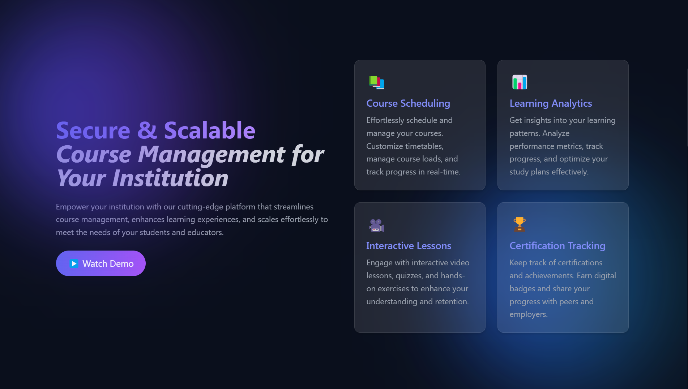
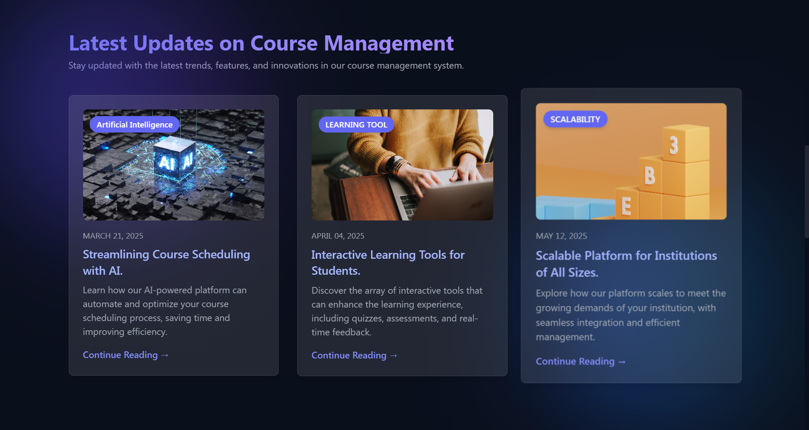
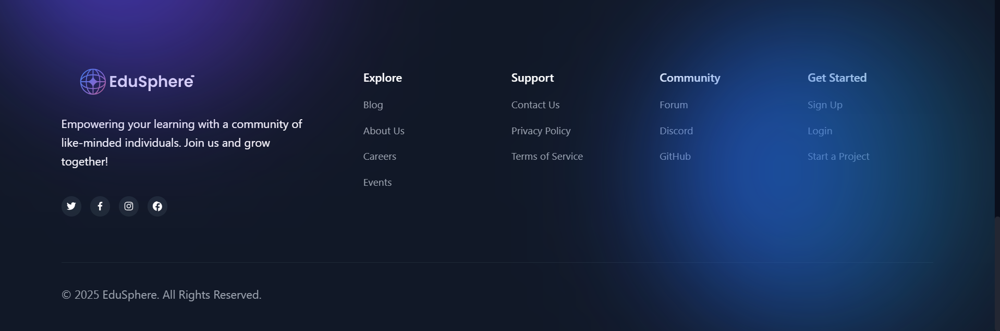
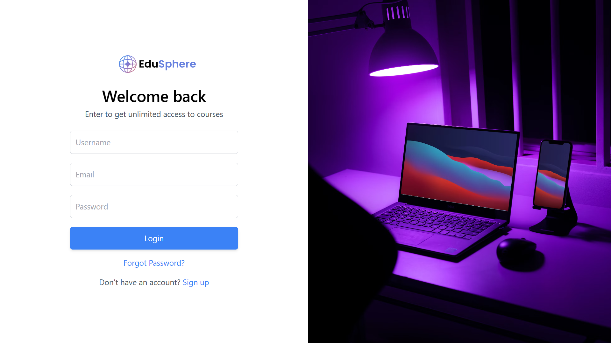
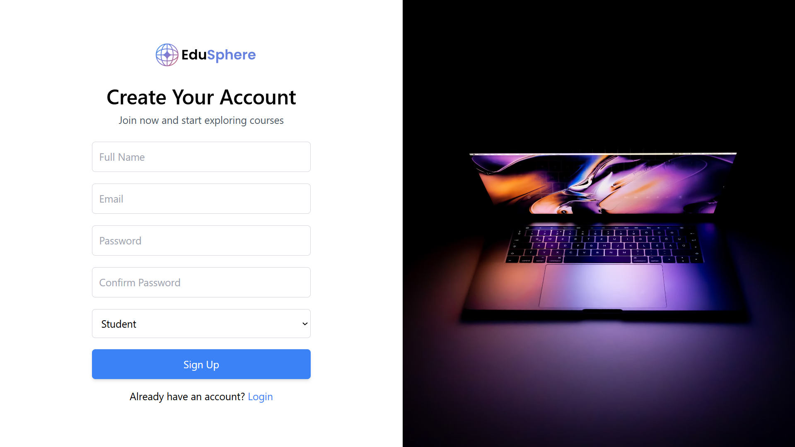
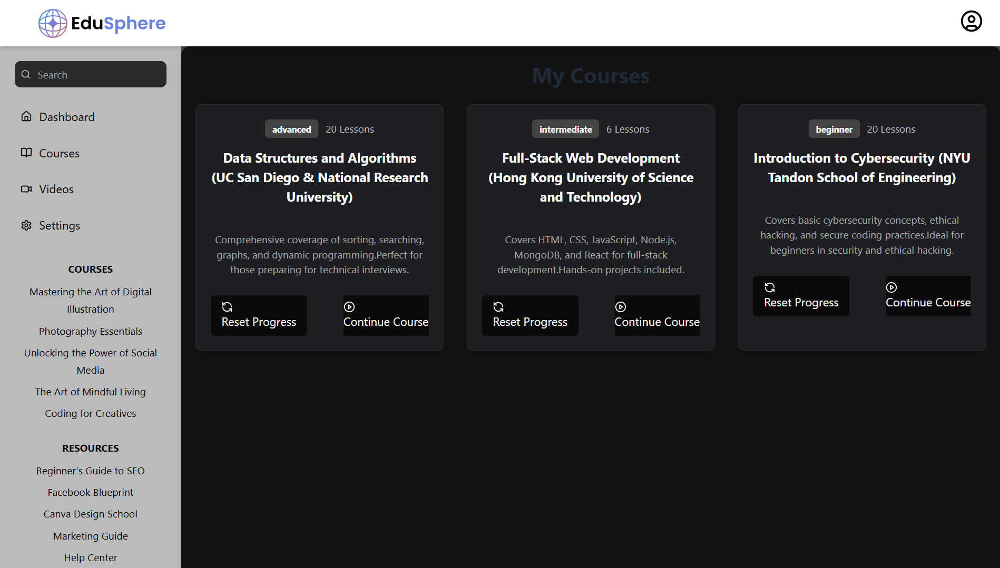
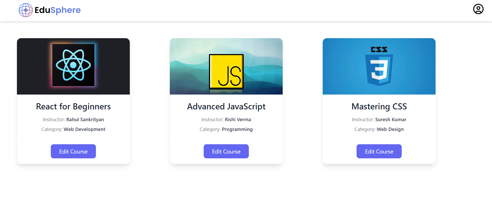
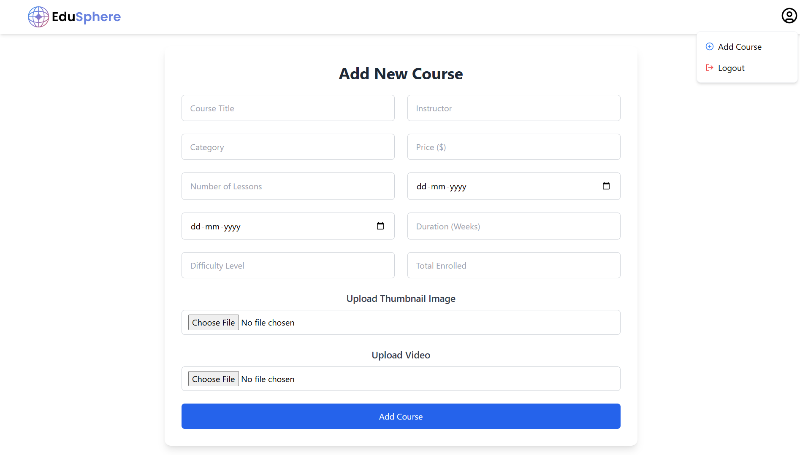
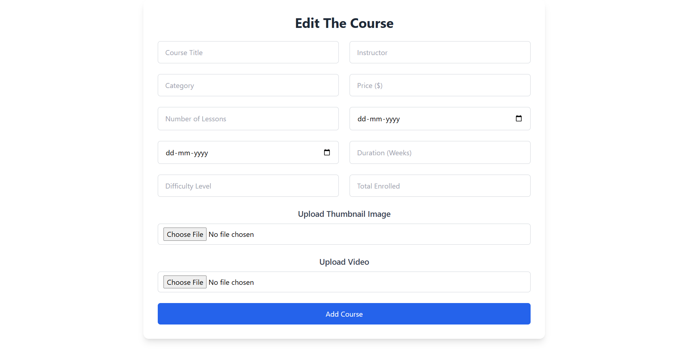

# Secure Learning Management System (LMS)

## 📌 Introduction
The **Secure Learning Management System (LMS)** is a highly secure and scalable platform designed for educational institutions and online learning platforms. It ensures data privacy, role-based access control, and seamless course management.

## 🚀 Features
- 🔐 **Secure User Authentication** (JWT-based authentication, OAuth2 support)
- 🎓 **Course Management** (Create, edit, delete, and manage courses)
- 👨‍🏫 **Role-Based Access Control** (Admins, Instructors, and Students)
- 📂 **Content Protection** (DRM for video lectures, encrypted file storage)
- 📈 **Analytics & Reporting** (Student progress tracking, instructor dashboards)
- 📡 **Scalability** (Optimized backend to handle thousands of concurrent users)

## 🛠️ Tech Stack
- **Frontend:** ReactJS, Next.js, Tailwind CSS
- **Backend:** Node.js, Express.js, MongoDB
- **Authentication:** JWT, OAuth2
- **Cloud & Deployment:** AWS (EC2, S3, Lambda), Docker, Kubernetes
- **Security:** AES Encryption, DRM for videos, HTTPS enforcement

## 🏗️ Installation
### Prerequisites
- Node.js & npm installed
- Sqlite Setup

### Steps
```sh
git clone https://github.com/your-repo/secure-lms.git
npm install
npm run dev
```

## 🛡️ Security Measures
- End-to-end encryption for user data
- Secure API endpoints with rate limiting
- DRM integration for secure video streaming
- Role-based access control to restrict unauthorized actions

## 🖼️ Screenshots
Here are some screenshots of the Secure LMS:

##[Landing Page](screenshots/Sc1.png)










## 🤝 Contributing
Contributions are welcome! Follow these steps:
1. Fork the repository
2. Create a new branch (`feature-xyz`)
3. Commit your changes
4. Submit a Pull Request

## 📄 License
This project is licensed under the **MIT License**.

---
💡 _Empowering Education Securely!_

